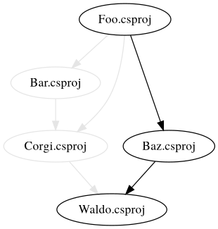

# Autograph

A utility that creates [dot graphs](https://graphviz.org/doc/info/lang.html) 
from .NET projects.

## Installation

```
> dotnet tool install -g dotnet-autograph
```

## Usage

```
USAGE:
    dotnet autograph <PROJECTS> [OPTIONS]

ARGUMENTS:
    <PROJECTS>    The project(s) to build a graph from

OPTIONS:
    -h, --help               Prints help information
        --output <OUTPUT>    The filename of the resulting graph
```

## Example

To create a dot graph for project `~/source/foo/foo.csproj` 
in the current working directory:

```
> dotnet autograph ~/source/foo/foo.csproj 
```

You can also specify the output path:

```
> dotnet autograph ~/source/foo/foo.csproj --output ~/foo.dot
```

This will output something like this:



## Building

We're using [Cake](https://github.com/cake-build/cake) as a 
[dotnet tool](https://docs.microsoft.com/en-us/dotnet/core/tools/global-tools) 
for building. So make sure that you've restored Cake by running 
the following in the repository root:

```
> dotnet tool restore
```

After that, running the build is as easy as writing:

```
> dotnet cake
```

## Copyright

Copyright (c) 2020 Patrik Svensson